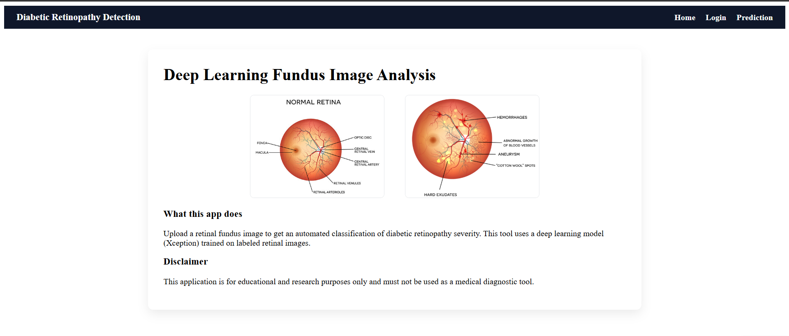
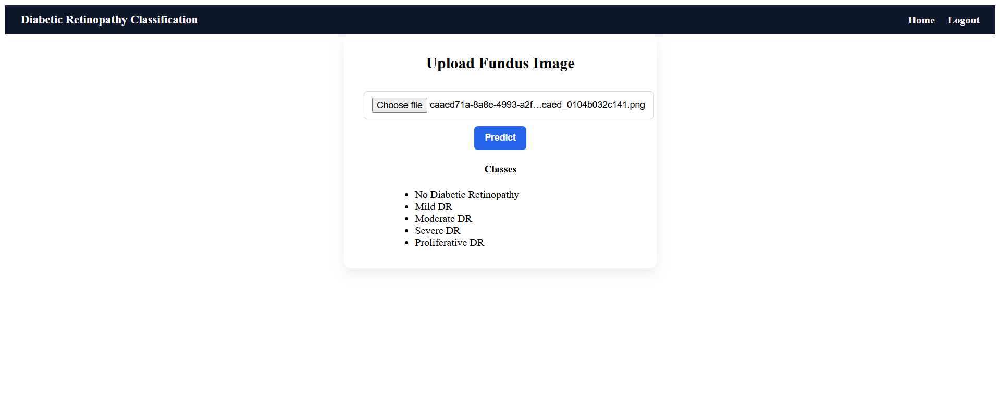
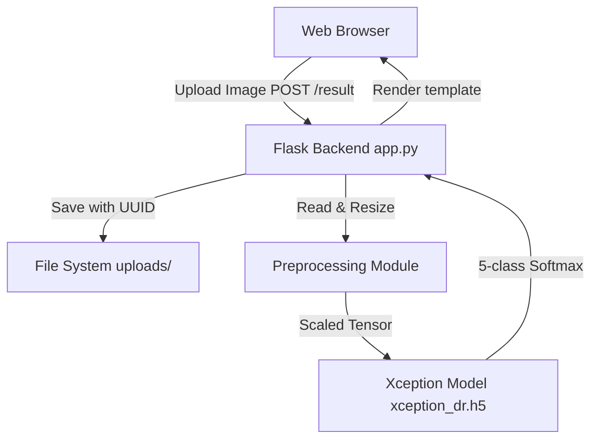

# Diabetic Retinopathy Detection

> Automated fundus image grading across five severity levels using a fine-tuned Xception CNN and a Flask web application.

[](https://www.python.org/)
[](https://www.tensorflow.org/)
[](https://flask.palletsprojects.com/)

---

## Overview

Diabetic retinopathy (DR) is a leading cause of preventable blindness. This project automates the classification of retinal fundus photographs into five DR severity grades — No DR, Mild, Moderate, Severe, and Proliferative DR. It uses deep transfer learning via a pre-trained Xception Convolutional Neural Network (CNN). A Flask-based web application wraps the model to provide a seamless, browser-based inference interface.

> **Disclaimer:** For educational and research purposes only. Not a clinical diagnostic tool.

### Application Preview


*Fig 1: Home Page showing project introduction.*


*Fig 2: Prediction Interface for uploading fundus images.*

---

## Key Features

*   **5-Class Image Classification:** Grades retinal images into 5 severity categories.
*   **Deep Transfer Learning:** Uses the Xception architecture (ImageNet weights) with a custom classification head.
*   **Web-Based Inference:** Flask backend handles file uploads, preprocessing, model inference, and template rendering.
*   **Secure File Handling:** Uses UUID prefixing for user uploads to prevent file collisions.
*   **Session Management:** Flask sessions restrict the prediction endpoint to authenticated (demo) users.
*   **Robust Logging:** Integrates `RotatingFileHandler` for application tracking (max 5MB, 3 backups).
*   **Data Augmentation:** Training pipeline employs rotation, width/height shifts, zoom, and horizontal flipping.

---

## Data Source

**Dataset:** [Diabetic Retinopathy Level Detection](https://www.kaggle.com/datasets/arbethi/diabetic-retinopathy-level-detection?select=preprocessed+dataset)

**Source:** [Kaggle](https://www.kaggle.com/datasets/arbethi/diabetic-retinopathy-level-detection?select=preprocessed+dataset)

**License:** [CC0 1.0 Universal](https://creativecommons.org/publicdomain/zero/1.0/)

**Usage:** Provides the preprocessed retinal fundus images used to train and evaluate the Xception CNN model for classifying diabetic retinopathy severity into 5 grades.

---

## Architecture / System Design

The application follows a standard client-server architecture with an embedded machine learning inference engine.



---

## Tech Stack

*   **Languages:** Python, JavaScript, HTML5, CSS3
*   **Deep Learning Framework:** TensorFlow 2.15.0, Keras 2.15.0
*   **Model Backbone:** Xception (`tf.keras.applications`)
*   **Backend Web Framework:** Flask 3.0.2
*   **Image Processing:** Pillow 10.2.0, NumPy 1.26.4
*   **Data Science Tools:** Pandas, scikit-learn, Matplotlib, Seaborn

---

## Project Structure

```text
Diabetic-Detection/
├── app.py                      # Main Flask application and API routes
├── config.py                   # Centralized configuration (paths, keys)
├── requirements.txt            # Python dependencies
├── ml/                         # Machine Learning pipeline
│   ├── preprocessing.py        # Image load and preprocess utilities
│   ├── train_xception.ipynb    # Model training and data augmentation pipeline
│   └── evaluate.ipynb          # Evaluation metrics (confusion matrix, report)
├── models/                     
│   └── xception_dr.h5          # Trained Xception model weights (92 MB)
├── screenshots/                # Application UI screenshots
├── static/                     # CSS, JavaScript, and static images
├── templates/                  # HTML templates
└── uploads/                    # Directory for user uploads
```

---

## Core Workflow

1.  **Input:** User accesses the web interface and uploads a retinal fundus image (.jpg or .png).
2.  **Storage:** Backend assigns a unique UUID to the file to prevent collision and saves it to `uploads/`.
3.  **Preprocessing:** Image is loaded, resized to 299x299, converted to a tensor, and scaled to `[-1, 1]` using Xception's `preprocess_input`.
4.  **Inference:** The tensor is passed to the globally loaded Xception model.
5.  **Output:** The predicted DR grade is retrieved via `argmax` and rendered on the frontend.

---

## Implementation Details

*   **Model Initialization:** The 92 MB model is loaded globally upon application startup to avoid inference latency per HTTP request.
*   **Logging:** Events, including logins and predictions, are logged to `logs/app.log`.
*   **Configuration Management:** `config.py` acts as a single source of truth for file paths and parameters.
*   **Routing Logic:** Routes are protected using `session` state. Users must log in via a demo authentication flow before inference.

---

## Algorithms / Models

**Xception CNN (Extreme Inception):**
Xception is used as the backbone because its depthwise separable convolutions offer high accuracy with fewer parameters, reducing overfitting risks on medical datasets. 

**Custom Classification Head:**
The base layers are frozen. The network is augmented with a custom head:
`GlobalAveragePooling2D → Dense(512, ReLU) → Dropout(0.5) → Dense(5, Softmax)`.
Training utilizes the Adam optimizer with categorical cross-entropy.

---

## API

| Method | Endpoint | Purpose |
|---|---|---|
| `GET` | `/` | Renders the landing page. |
| `GET` | `/login` | Renders the demo login page. |
| `POST` | `/afterlogin`| Processes login credentials and creates a session. |
| `GET` | `/prediction`| Renders the image upload form (requires active session). |
| `POST` | `/result` | Accepts image file, runs inference, and returns prediction. |
| `GET` | `/logout` | Clears user session and logs out. |

---

## Security

*   **File Name Sanitization:** User-uploaded files are prepended with `uuid.uuid4()` to prevent path traversal and file overwrites.
*   **Session Management:** Flask's signed cookies handle session tracking to protect internal routes (`/prediction`).
*   **Environment Configuration:** Sensitive variables like `SECRET_KEY` are isolated in `config.py`.

---

## Performance / Optimization

*   **Singleton Model Loading:** Prevents disk I/O bottlenecks during prediction by holding the model in RAM.
*   **Efficient Preprocessing:** Utilizes vectorized NumPy operations for image scaling prior to tensor operations.
*   **Log Rotation:** Caps logs at 5MB with 3 backups to prevent disk space exhaustion.

---

## Results / Outcomes

*   **Model Evaluation:** Evaluated on a validation dataset using accuracy, precision, recall, and F1 scores. 
*   **Visual Metrics:** A Seaborn-generated confusion matrix identifies misclassifications between adjacent DR grades.
*   **Application Success:** Successfully provides fast inference response times in a web environment.

---

## Challenges & Engineering Decisions

1.  **Feature Extraction vs. Fine-Tuning:** 
    *   *Decision:* Keep the base model frozen and train only the classification head.
    *   *Rationale:* Medical datasets are small. Full fine-tuning risks catastrophic forgetting and overfitting. ImageNet features generalize well to fundus textures.
2.  **Concurrency in Flask:** 
    *   *Challenge:* Handling multiple users uploading files named `image.jpg`.
    *   *Solution:* Implemented UUID prefixing on the server-side to guarantee unique file paths.
3.  **Inference Latency:**
    *   *Challenge:* Loading a 92 MB model per request is slow.
    *   *Solution:* Instantiated `model = load_model()` at the module level (singleton).

---

## Limitations

*   **Demo Authentication:** The login route accepts any non-empty credentials. No actual password hashing or database integration exists, despite `cloudant` being listed in requirements.
*   **Storage Accumulation:** Uploaded images in `uploads/` are not automatically purged.

---

## Future Improvements

*   **Grad-CAM Visualizations:** Generate heatmaps overlaying the input image to explain model predictions.
*   **Database Integration:** Implement real user authentication and track prediction history.
*   **Automated Cleanup:** Add a background task to delete images older than 24 hours from `uploads/`.

---

## How to Run

### Prerequisites
*   Python 3.9 - 3.11 (Required for TensorFlow 2.15)
*   Git

### Execution Steps
```bash
git clone <repository-url>
cd Diabetic-Detection
python -m venv venv
# On Windows:
venv\Scripts\activate
# On macOS/Linux:
source venv/bin/activate

pip install -r requirements.txt
python app.py
```
Navigate to `http://127.0.0.1:5000`.

---

## Project Highlights

*   **End-to-End ML Pipeline:** Bridges Jupyter notebook experimentation with a functional Flask web application.
*   **Production-Oriented Architecture:** Uses singleton model loading and structured log rotation.
*   **Transfer Learning Mastery:** Demonstrates practical application of Xception for complex medical classification.
*   **Modular Design:** Separated into ML pipelines (`ml/`), routing (`app.py`), and configuration (`config.py`).

---

## Summary

**Problem Solved:** Automates Diabetic Retinopathy severity grading from retinal images.
**Technical Approach:** Deep transfer-learning pipeline utilizing the Xception architecture, exposed via a Flask web app.
**Architecture:** Monolithic backend managing session state, file I/O, and model inference locally.
**Important Technologies:** Python, TensorFlow/Keras, Flask, Pillow, HTML/CSS/JS.
**Engineering Decisions:** Used a frozen pre-trained backbone to prevent overfitting; utilized UUID file prefixing for concurrency safety; loaded model as a global singleton.
**Major Challenges:** Bridging ML research environments with web application constraints.
**Current Project Status:** Fully functional academic prototype with demo authentication.
**Skills Demonstrated:** Deep Learning (CNNs), Backend Web Development (Flask), System Design, Code Modularity.
